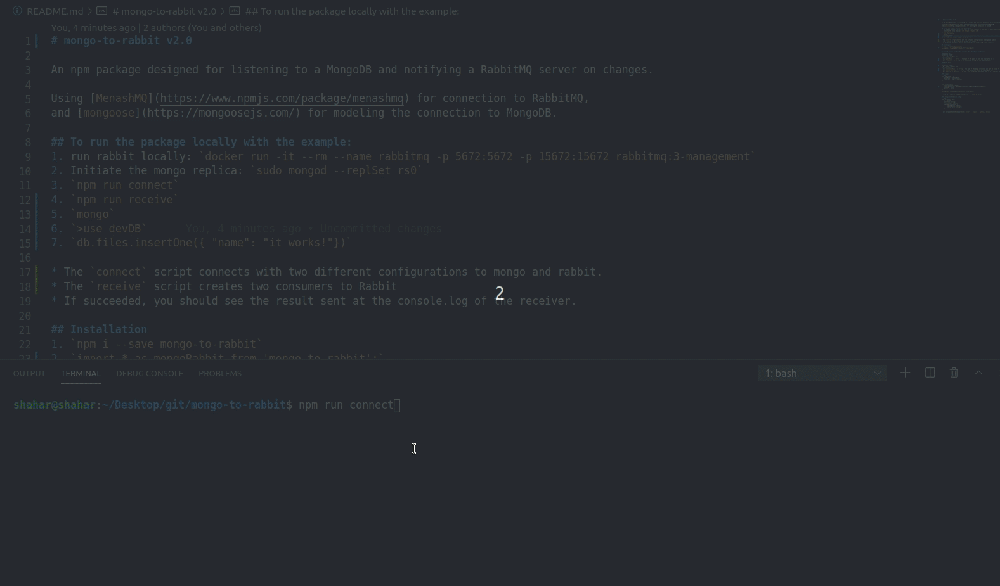

# mongo-to-rabbit v2.0

An npm package designed for listening to a MongoDB and notifying a RabbitMQ server on changes.

Using [MenashMQ](https://www.npmjs.com/package/menashmq) for connection to RabbitMQ,
and [mongoose](https://mongoosejs.com/) for modeling the connection to MongoDB.

## To run the package locally with the example: 
1. run rabbit locally: `docker run -it --rm --name rabbitmq -p 5672:5672 -p 15672:15672 rabbitmq:3-management`
2. Initiate the mongo replica: `sudo mongod --replSet rs0`
3. `npm run connect`
4. `npm run receive`
5. `mongo`
6. `>use devDB`
7. `db.files.insertOne({ "name": "it works!"})`

* The `connect` script connects with two different configurations to mongo and rabbit. 
* The `receive` script creates two consumers to Rabbit
* If succeeded, you should see the result sent at the console.log of the receiver.

## Installation
1. `npm i --save mongo-to-rabbit`
2. `import * as mongoRabbit from 'mongo-to-rabbit';`  
`mongoRabbit.watchAndNotify(mongoData, rabbitData);`

## In order to use the package, you must send two object parameters:

### Rabbit Data:
contains 2 fields: 
| #  | field | type | info |
|---|---|---|---|
| 1 | `queueName`  | `string` | the name of the queue to send the information to |
| 2 | `rabbitURI `  | `string` | the connection string for the rabbitMQ server |

### Mongo Data:

contains 3 fields:
| #  | field | type | info |
|---|---|---|---|
| 1 | `collectionName`  | `string` | the name of the mongo collection you want to listen to |
| 2 | `connectionString `  | `string` | the connection string of the mongo server |
| 6 | `prettify` | `boolean`  | if true, will filter the result and send it in a specific formt |

#### Example: 
```node
`let rabbitData = {  
    queueName: 'myQueueName',  
    rabbitURI: 'amqp://localhost'  
};`  


`let mongoData = {  
    collectionName: 'files',  
    connectionString: 'mongodb://localhost:27017/devDB?replicaSet=rs0',  
    prettify: false  
};`  
```
`mongoRabbit.watchAndNotify(mongoData, rabbitData);`

* For a more specific example, look at the `src/example` folder.

#### The prettified type format:
```node
type DataObjectType = {  
    id: string;  
    operation: string;  
    fullDocument: object;  
    updateDecsctiption: {  
        updatedFields: object;  
        removedFields: string[];  
    };  
}
```
* will only work on these operations: `insert`, `replace`, `update`, `delete`

